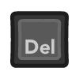
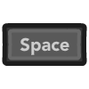
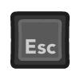

# Getting started: Input and controls

## Game controllers

RetroArch is intended to be easily controlled with a controller. RetroArch uses
the overall term **controller** which encompasses all input hardware that could
be described by the terms **joypad**, **gamepad**, **joystick** and others.

!!! info "Map controls by controller, core, or game"
    RetroArch allows users to configure a controller once for many cores instead
    of having to configure each core individually. RetroArch also provides the
    freedom to configure specific cores and even individual games differently if
    the user wants.

### What is a RetroPad?

RetroArch maps real-world controller inputs to a virtual controller, called a
`RetroPad`, that resembles the common modern controller layout with:

- A directional pad
- Four face buttons with an A/B/X/Y layout like an SNES gamepad, namely:
  + :material-alpha-a-circle: – right
  + :material-alpha-b-circle: – bottom
  + :material-alpha-x-circle: – top
  + :material-alpha-y-circle: – left
- Select / Start buttons
- Two shoulder buttons: :guides-gamepad-button-l1:, :guides-gamepad-button-r1:
- Two trigger buttons: :guides-gamepad-button-l2:, :guides-gamepad-button-r2:
- Dual analog sticks (like a Sony DualShock), which also function as buttons:
  :guides-gamepad-stick-l3:, :guides-gamepad-stick-r3:

You don't have to map all of the RetroPad buttons to a real-world input. If your
real controller has fewer buttons than a DualShock, then the virtual RetroPad
will have some un-mapped buttons; that's perfectly fine! If your real controller
has more buttons, they may be configured to act as custom hotkeys.

Conceptually, all RetroPad buttons can be designated as analog (pressure
sensitive), but the hardware typically only supports this for the trigger
buttons. Gyroscope, acceleration and illumination sensors may also be supported,
very much depending on the input driver that's used as well as the core.

### Controller autoconfiguration

Most well-known controllers should work out of the box, thanks to the RetroArch
auto-configuration profile database. If a controller can be auto-configured, the
on-screen display will inform you of the auto-configuration event. The menu
hotkey is often predefined in these profiles.

!!! info "Manual RetroPad binding"
    Not all controllers have an auto-configuration profile available. If that is
    the case for your controller, please refer to the
    [§ Manual RetroPad Binding](#manual-retropad-binding) section below.

## Keyboard controls

RetroArch provides a re-mappable set of bindings between a keyboard and the
RetroPad abstraction, and also between a keyboard and RetroArch's hotkeys;
for more information, see the
[§ Default RetroArch keyboard bindings](#default-retroarch-keyboard-bindings)
section below.

### Cores with direct keyboard input

Please be aware that some cores, including many of those for arcade emulators
and vintage computers, can also be configured to directly read the keyboard or
controls that use a keyboard interface. **If you are using a core configured for
direct keyboard access, it is recommended to use the `Game Focus` mode (default:
++scroll-lock++) to disable those bindings while using the keyboard device,** or
unbind the conflicting keyboard-to-RetroPad and hotkey bindings if only a few
keys are needed. Otherwise, keyboard input will be captured by the RetroArch
hotkeys and prevent the core from receiving the signal.

!!! tip
    Controls with keyboard interfaces can also benefit from defining a **Hotkey
    Enable** button. If this hotkey is defined, other hotkeys will not function
    unless it is pressed.

## Manual RetroPad binding

If your gamepad cannot be auto-configured or if you would like to change its
RetroPad binding, use the **Input** settings menu.

1. Navigate to `Settings` --> `Input` --> `RetroPad Binds` --> `Port 1 Controls`
1. Select **`Set All Controls`**
1. Press the buttons as required

!!! tip
    If you have several different controllers, use the **`Save Controller
    Profile`** option after configuring the bindings for each of them, so that
    they will be recognized and reconfigured that way in the future
    automatically.

## Controls for multi-player

If you want to configure local multiplayer action for games that support it,
navigate to `Settings` --> `Input` --> `RetroPad Binds` to access all of the
options to set input bindings for multiple users. Here's an example of setting
up a gamepad specifically for User 1:

1. Navigate to `Settings` --> `Input` --> `RetroPad Binds` --> `Port 1 Controls`
1. Select **`Device Index`**
1. Identify which currently plugged-in controller will be assigned to this
   player. Then go back one level in the menu, select **`Port 2 Controls`** and
   repeat for User 2.

When using multiple controllers, RetroArch will assign them by default in the
order they are presented by the operating system, which is difficult to predict.
For more reliable behavior, use the device reservation options to explicitly
assign a controller to a specific player.

## Hotkeys

Hotkeys are combinations of buttons you can press in order to access options
such as saving, loading and exiting games. Hotkey binds can be configured at
`Settings` --> `Input` --> `Hotkeys`. If you map **`Enable Hotkeys`** to a
button, it will require that button to be held in order to trigger any hotkeys.

!!! tip
    To unbind a hotkey (disabling it, effectively), press the ++delete++ key on
    your keyboard or the :material-alpha-y-circle: button (the leftmost of the
    four buttons) on the RetroPad. To reset a hotkey to its default, press the
    ++space++ bar on your keyboard or the :guides-gamepad-button-start: button
    on the RetroPad.

## Remapping controls for individual cores or content

Remapping controls per-core alters how the core receives input rather than how
the gamepad is interpreted, for example you can tell an individual core to
switch the A and B buttons on the RetroPad for gameplay, but still be able to
use the A button to make selections in the RetroArch menu, and likewise, use the
B button to go back in the menu. This is opposed to changing the RetroArch
bindings for the gamepad itself, which would swap the A and B buttons while
using the core, but also make the B button perform selections and the A button
move back in the RetroArch menu.

### How to remap the controls for a single core or game

1. Launch a content item using the core for which you wish to remap controls.
1. Open the **`Quick Menu`** and select **`Controls`**.
1. Configure the inputs as you want them to be.
1. Select one of the following options:
   + **`Save Core Remap File`**, to configure those controls for all content run
     by that core, or
   + **`Save Game Remap File`**, if you want to save the new mappings for use
     only with the content currently running

## Default RetroArch keyboard bindings

### Key bindings cheat sheet

Commands as of 2025-05-12, superimposed over a US-layout laptop keyboard; for
the most recent key bindings, see the sections directly below this one.

### General controller mapping

These controls are valid both in-game and in the menu:

| User 1 Keyboard                                                                         | Default RetroPad Mapping                                  | Menu Action                                  |
|-----------------------------------------------------------------------------------------|-----------------------------------------------------------| -------------------------------------------- |
|        |        | Move cursor up                               |
|    |    | Move cursor down                             |
|    |    | Move cursor left                             |
|  |  | Move cursor right                            |
|                      |             | Scroll one page up                           |
|                      |             | Scroll one page down                         |
|                      |               | Return to the previous screen                |
|                      |               | Select Item                                  |
|                      |               | Scan content / Remove highlighted input bind |
|                      |               | Search                                       |
|              |     | Help                                         |
|              |       | (see next section)                           |

### Menu controls

While in the menu, there are additional navigation keys defined for convenience.

| Keyboard Input                                                                      | Retropad Input                                       | Menu Action                                                      |
| ----------------------------------------------------------------------------------- | ---------------------------------------------------- | ---------------------------------------------------------------- |
|  |          | Return to the previous screen                                    |
|          |          | Select Item (note: Enter key is mapped to Select button in-game) |
|              |          | Scan content / Remove highlighted input bind                     |
|              |          | Search                                                           |
|          |  | Reset to default                                                 |
|                                                                                     |        | Scroll to previous letter                                        |
|                                                                                     |        | Scroll to next letter                                            |
|            |        | Scroll to top                                                    |
|              |        | Scroll to bottom                                                 |

Analog sticks are also able to control the menu. If needed, additional hotkeys
can be disabled in `Settings` → `Input` → `Menu Controls`, along with several other customization options.

### Hotkey controls

Hotkey binds can be configured at `Settings` --> `Input` --> `Hotkeys`. If you
map `Enable Hotkeys` to a key, it will require that key to be held in order to
trigger any hotkeys. This can be useful in avoiding keyboard mapping conflicts
between RetroArch and cores cores that use the keyboard for input.

!!! tip
    Hotkeys can also be mapped to controller buttons.

| Keyboard Input                                                                 | In-Game Action               |
| ------------------------------------------------------------------------------ | ---------------------------- |
|         | Exit RetroArch               |
|  | Fast forward toggle          |
|             | Fast forward hold            |
|             | Pause                        |
|             | Frame advance                |
|             | Slow motion                  |
|             | Rewind                       |
|             | Reset                        |
|           | Menu toggle                  |
|           | Save state                   |
|           | Show FPS                     |
|           | Load state                   |
|           | Desktop menu                 |
|           | Decrease current state slot  |
|           | Increase current state slot  |
|           | Take screenshot              |
|           | Mute                         |
|         | Grab mouse                   |
|          | Volume Up                    |
|         | Volume Down                  |
|             | Fullscreen toggle            |
|             | Next shader                  |
|             | Previous shader              |
|             | Netplay toggle play/spectate |
|             | Cheat toggle                 |
|             | Next cheat                   |
|             | Previous cheat               |

## Platform-specific controls

### Nintendo Switch

USB keyboards and mice: All keyboards seem to work, but not all mice seem to
work; see the [mouse compatibility sheet][mouse-compat-sheet] for more details.

Touch mouse emulation: The Switch touchscreen can be used for mouse control like
a laptop touchpad. The following gestures are supported:

| Touch Input               | Effect                                                 |
|---------------------------|--------------------------------------------------------|
| Single finger swipe       | Move the mouse pointer (indirectly like on a touchpad) |
| Single finger tap         | Left mouse click                                       |
| Two-finger short tap**¹** | Right mouse click                                      |
| Two-finger swipe          | Drag'n'Drop (left mouse button is held down)           |
| Three-finger swipe        | Drag'n'Drop (right mouse button is held down)          |

**¹** _Hold one finger in place and short tap with another._

[mouse-compat-sheet]: https://docs.google.com/spreadsheets/d/1Drbo5-QuSX901MwtOytSMuqRGxeIkq2HELM806I9dj0/edit#gid=0
