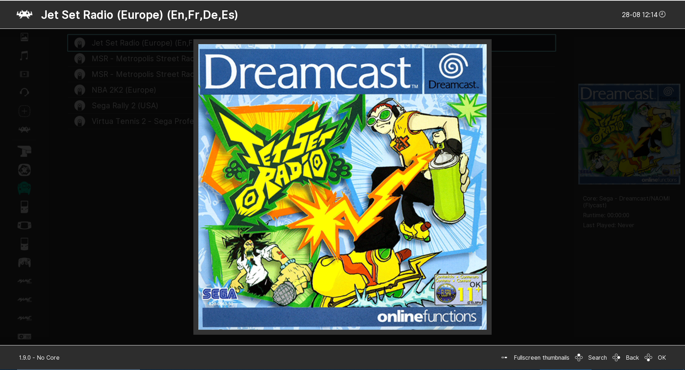

# Ozone (GUI)

<!--
  SPDX-FileCopyrightText: © 2020, Ömercan Kömür <fpscan@gmail.com>
  SPDX-FileCopyrightText: © 2021, Colin L. Crowley <sanaki@fuzzy-dice.net>
  SPDX-FileCopyrightText: © 2021, Mark W. Kidd <mark@stardart.net>
  SPDX-FileCopyrightText: © 2024, Carl Mitchell <mmmchocolate@gmail.com>
  SPDX-FileCopyrightText: © 2026, Peter J. Mello <admin@petermello.net>

  SPDX-License-Identifier: MIT
-->
**Ozone** is the default graphical user interface (gui) of RetroArch. Based on
the Nintendo Switch's menu design, this menu driver was introduced in RetroArch
v1.7.6.

!!! warning "DISCLAIMER"
    _Keyboard key assignments may differ by platform and configuration; most of
    the examples below are based on the Windows PC defaults._

## Menu structure

Ozone's main categories and playlists are in a column on the left, and
subcategories are in a panel to the right. A third column will appear on the
right-hand side when certain selections are made.

Entering a subcategory will hide the top-level menu's text labels. When you
return to Main Categories, the descriptions will reappear. The sidebar does not
collapse while in Main Menu or Settings.

If you want the labels to always be hidden, go to `Settings` -->
`User Interface` --> `Appearance` and enable **`Collapse the Sidebar`**.

### Navigating the menus

Ozone is controlled like any other user interface. Regular input binds will
apply, and binds here are defined in terms of the RetroPad, RetroArch's gamepad
and joystick abstraction.

| Controller                   | Default PC                                                 | Action                      |
|:----------------------------:|:----------------------------------------------------------:|:----------------------------|
| **A button**                 | ++z++/++enter++/Left mouse click                           | Accept/OK                   |
| **B button**                 | ++x++/++backspace++/Right mouse click                      | Back/Cancel                 |
| **D-pad Up/Down/Left/Right** | ++arrow-left++/++arrow-up++/++arrow-down++/++arrow-right++ | Scroll through menu options |
| N/A                          | **++right-shift++**                                        | Toggle description label    |
| N/A                          | **++s++**                                                  | Toggle search               |
| N/A                          | **++f1++**                                                 | Toggle quick menu           |
| N/A                          | **++f5++**                                                 | Toggle desktop menu         |

See [Input and Controls](input-and-controls.md).

### Searching through lists with the keyboard

When using a keyboard, it can be slow to navigate a large list using
gamepad-like controls. To help this, you can type ++slash++ or ++s++ at any time
to bring up a search box. Type a search string and hit ++enter++. The cursor
should jump to the first entry in the list that matches the entered string.

The search will match mid-path strings. However, if a match is found at the
beginning of the path (like when searching for the first letter), the
start-of-path match will take priority.

### Playing content

- To load a content file (i.e., a game) at least two elements are needed:
  1. A libretro core to act as the hardware system
  1. A content file, such as a ROM or an ISO, to play on that system
- Select `Load Core` from the main menu to browse the list of installed cores.
  Naturally the choice rests on the content you wish to run, as you need to
  select a core that will provide an environment compatible with the one it was
  originally created for.
- If you have no cores listed, or you want/need additional cores, navigate to
  `Online Updater` --> **`Download Core`** and select one from the list there.

After loading a libretro core, its name and version string will be displayed in
the lower-left corner of the display. You can then browse for a content file via
`Main Menu` --> **`Load Content`**.

To control where Ozone starts to browse for content files, go to `Settings` -->
`Directory` --> **`File Browser`** and choose a directory on your filesystem to
be the starting point when looking for content to load. If this is undefined,
the file browser will start in the user's home directory.

For more details, See [File Browser](file-browser.md) and
[Import Content](import-content.md).

## Input

See [Input and Controls](input-and-controls.md).

## Thumbnails

Thumbnails appear in a sidebar on the right side of the screen. With a playlist
item selected, you can press ++space++ on your keyboard to toggle the fullscreen
view on and off.

The default thumbnail is Box Art. Two thumbnails can be displayed simultaneously
by going to `Settings` --> `User Interface` --> `Appearance` and enabling
**`Secondary Thumbnail`**. The user can choose to display box art, the title
screen, or a screenshot.

## Audio

Ozone has **OK**, **Cancel**, **Notice** and **Scroll** sound effects. It also
has background music, created by [ViRiX Dreamcore][virix-dreamcore].

<audio controls>
  <source src="/image/retroarch/ozone/bgm.ogg" type="audio/ogg">
</audio>

These are turned off by default. To enable them, go to `Settings` --> `Audio`
--> `Menu Sounds` and turn on the **`Mixer`**. Then in the same menu, turn on
the sounds you want (the background music option is called `Enable BGM Sound`).

## Applying shaders

See the [Shaders User Guide](shaders.md).

## Themes

Ozone has a range of color schemes to choose from. They can be found in
`Settings` --> `User Interface` --> **`Appearance> Color Theme`**.

[virix-dreamcore]: https://soundcloud.com/virix
