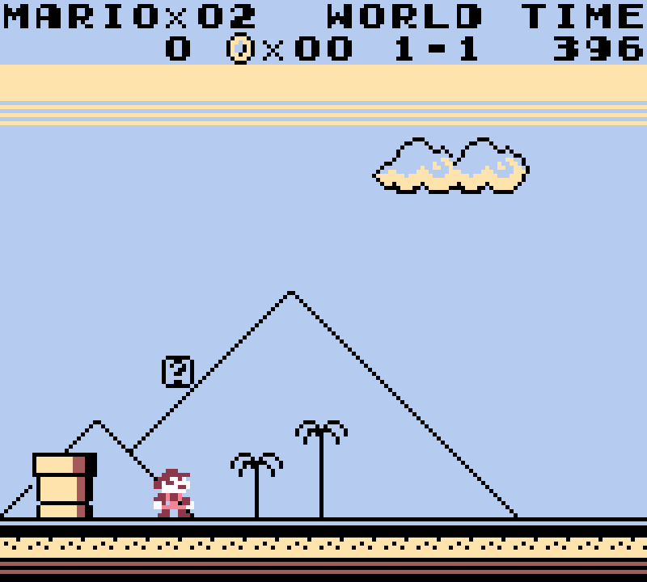
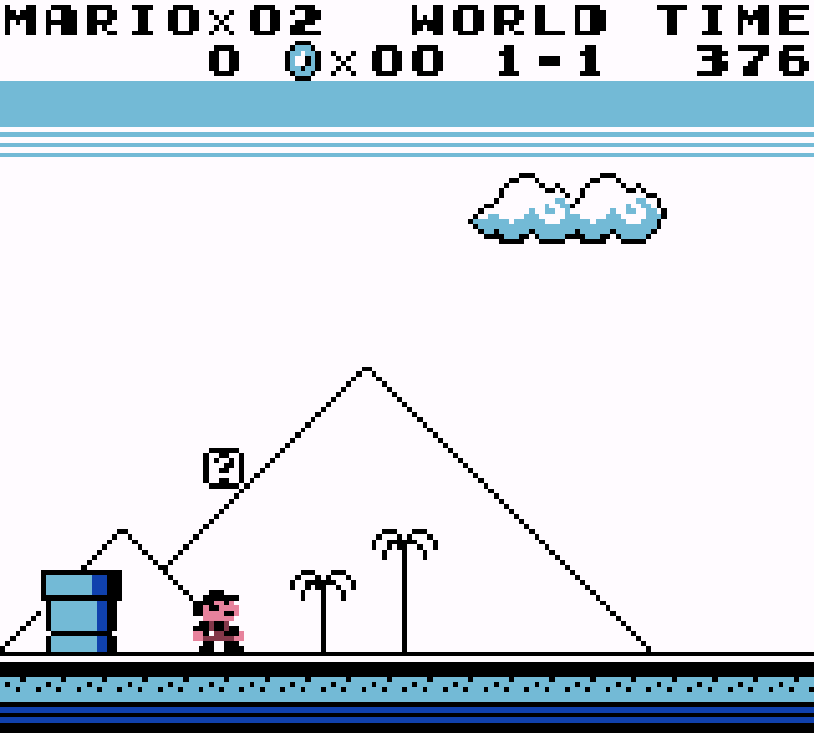
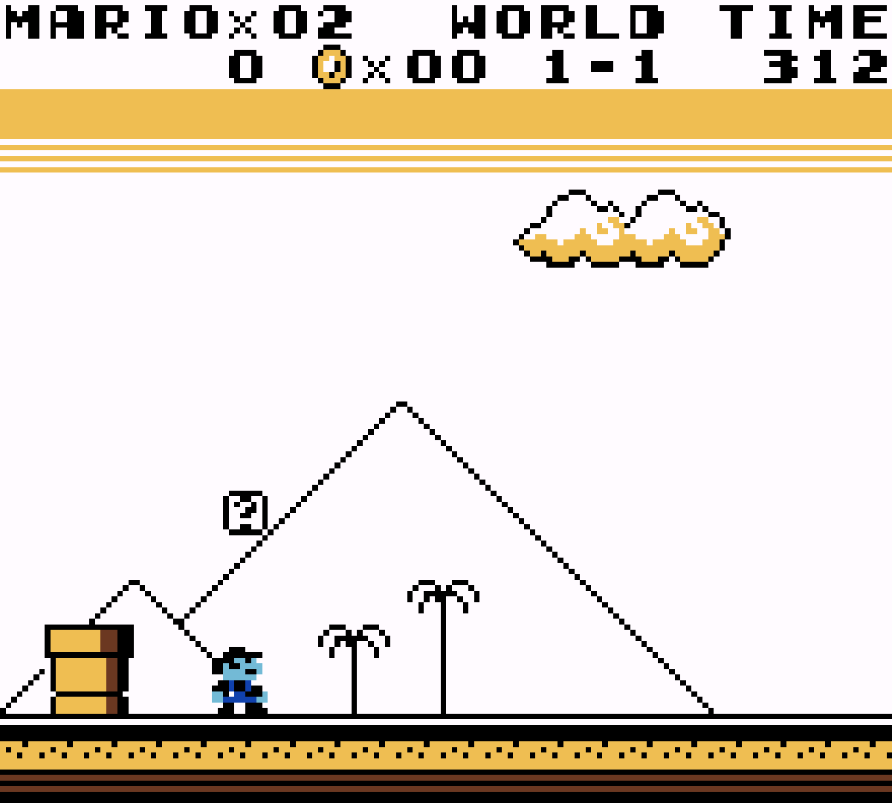
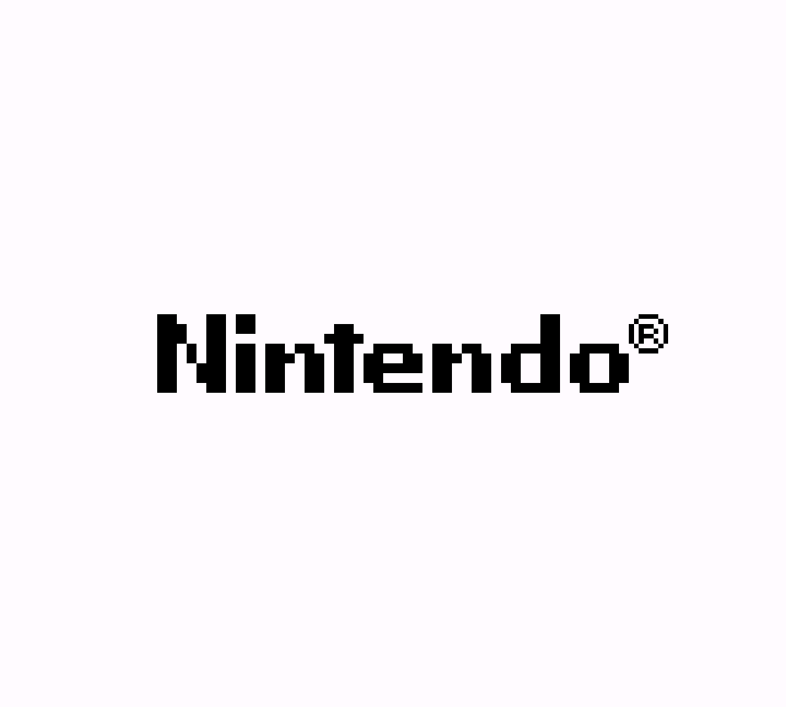
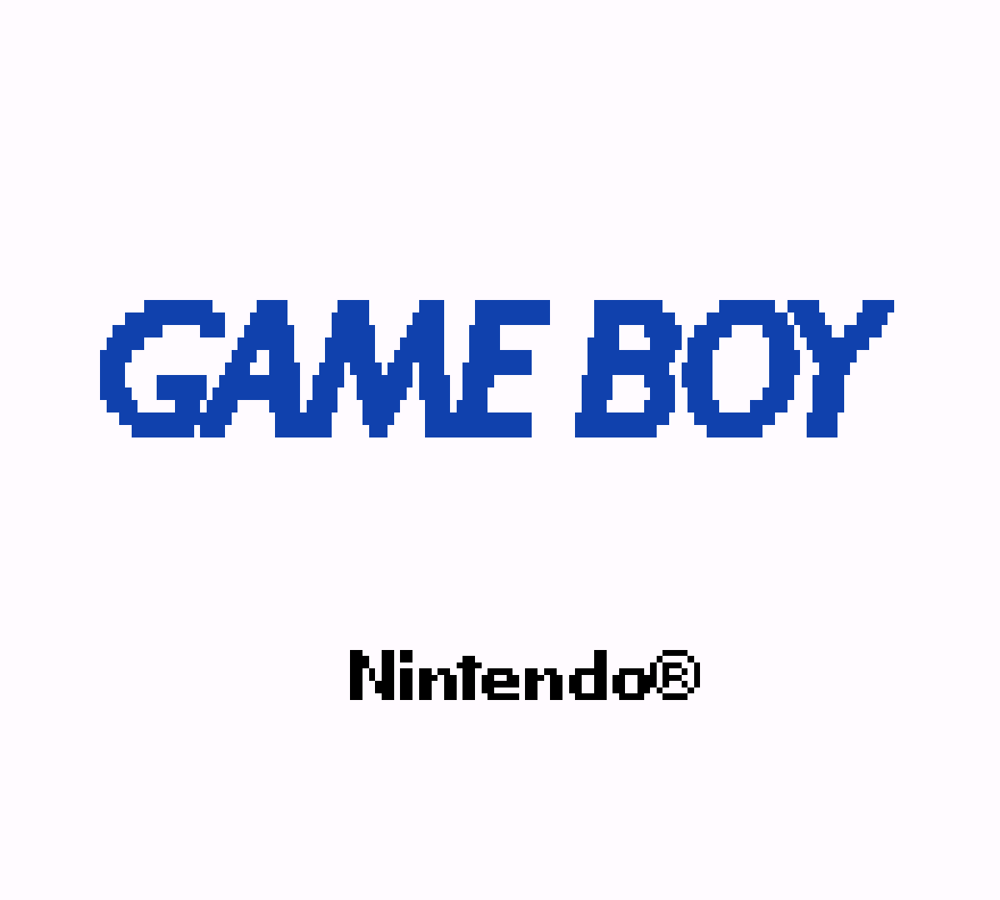

# Nintendo - Game Boy / Color (Gambatte)

## Background

Gambatte is an accuracy-focused, open-source, cross-platform Game Boy Color emulator written in C++. It is based on hundreds of corner case hardware tests, as well as previous documentation and reverse engineering efforts.

The Gambatte core has been authored by

- Sinamas

The Gambatte core is licensed under

- [GPLv2](https://github.com/libretro/gambatte-libretro/blob/master/COPYING)

A summary of the licenses behind RetroArch and its cores can be found [here](../development/licenses.md).

## BIOS

Required or optional firmware files go in the frontend's system directory.

!!! attention
	The ['Use official bootloader' core option](#core-options) must be set to On in order for these BIOS files to be used.

| Filename     | Description                    | md5sum                           |
|:------------:|:------------------------------:|:--------------------------------:|
| gb_bios.bin  | Game Boy BIOS - Optional       | 32fbbd84168d3482956eb3c5051637f5 |
| gbc_bios.bin | Game Boy Color BIOS - Optional | dbfce9db9deaa2567f6a84fde55f9680 |

## Extensions

Content that can be loaded by the Gambatte core have the following file extensions:

- .gb
- .gbc
- .dmg

RetroArch database(s) that are associated with the Gambatte core:

- [Nintendo - Game Boy](https://github.com/libretro/libretro-database/blob/master/rdb/Nintendo%20-%20Game%20Boy.rdb)
- [Nintendo - Game Boy Color](https://github.com/libretro/libretro-database/blob/master/rdb/Nintendo%20-%20Game%20Boy%20Color.rdb)

## Features

Frontend-level settings or features that the Gambatte core respects.

| Feature           | Supported |
|-------------------|:---------:|
| Restart           | ✔         |
| Saves             | ✔         |
| States            | ✔         |
| Rewind            | ✔         |
| Netplay           | ✕         |
| Core Options      | ✔         |
| [Memory Monitoring (achievements)](../guides/memorymonitoring.md) | ✔         |
| RetroArch Cheats  | ✔         |
| Native Cheats     | ✕         |
| Controls          | ✔         |
| Remapping         | ✔         |
| Multi-Mouse       | ✕         |
| Rumble            | ✔         |
| Sensors           | ✕         |
| Camera            | ✕         |
| Location          | ✕         |
| Subsystem         | ✕         |
| [Softpatching](../guides/softpatching.md) | ✔         |
| Disk Control      | ✕         |
| Username          | ✕         |
| Language          | ✕         |
| Crop Overscan     | ✕         |
| LEDs              | ✕         |

## Directories

The Gambatte core's library name is 'Gambatte'

The Gambatte core saves/loads to/from these directories.

**Frontend's Save directory**

| File  | Description            |
|:-----:|:----------------------:|
| *.srm | Cartridge battery save |

**Frontend's State directory**

| File     | Description |
|:--------:|:-----------:|
| *.state# | State       |

***Frontend's System directory**

| File                        | Description             |
|:---------------------------:|:-----------------------:|
| palettes/default.pal        | Global custom palette   |
| palettes/'content-name'.pal | Per-game custom palette |

## Geometry and timing

- The Gambatte core's core provided FPS is 59.7275005696
- The Gambatte core's core provided sample rate is [Sample rate]
- The Gambatte core's base width is [Base width]
- The Gambatte core's base height is [Base height]
- The Gambatte core's max width is [Max width]
- The Gambatte core's max height is [Max height]
- The Gambatte core's core provided aspect ratio is [Aspect ratio]

## Color Palette

- The [core option](#core-options) `GB Colorization` enables colorization of Game Boy games, using pre-defined or user-selected color palettes.
- When satisfied you can save the currently chosen palette per the whole core, per content-directory or per game with the usual RetroArch [override](../guides/overrides.md) mechanism.
- During gameplay you can instantly swap color palettes.
  - You can cycle through the available color palettes with the [L/R shoulder buttons](#joypad).
  
    (Source: Feature request in issue [182](https://github.com/libretro/gambatte-libretro/issues/182) was implemented in pull request [204](https://github.com/libretro/gambatte-libretro/pull/204) in October 2021)
  - This is ideal for your initial browsing / exploration of the color palettes.
  - But also if you spontanously want to change the palette in your currently running game.

### Custom palettes for Game Boy games

The 'GB Colorization' core option must be set to custom.

Create a folder called "palettes" in RetroArch's system directory. Then, you can place custom palette files (.pal) inside the "palettes" folder

You can define different palettes for specific games by creating a .pal file in the "palettes" folder with 'INTERNALROMNAME.pal' or "rom-name.pal". If no specific palette is found for a ROM then the default palette is used.

You can also define a palette to be used for all Game Boy games by creating a .pal file in the "palettes" folder named "default.pal"

??? note "*Custom palettes can be created from the GUI in standalone Gambatte*"
    

## Core options

The Gambatte core has the following option(s) that can be tweaked from the core options menu. The default setting is bolded.

Settings with (Restart) means that core has to be closed for the new setting to be applied on next launch.

- **Allow Opposing Directions** [gambatte_up_down_allowed] (**disabled**/enabled)

	Enabling this will allow pressing / quickly alternating / holding both left and right (or up and down in some games) directions at the same time.

	This may cause movement based glitches to occur in certain games.

	It's best to keep this core option disabled.

- **GB Colorization** [gambatte_gb_colorization] (**disabled**|auto|GBC|SGB|internal|custom)

	Enables colorization of Game Boy games, using pre-defined or user-selected color palettes.

	'auto': Selects automatically the 'best' (most colorful/appropriate) palette for each individual game, using the following order of preference:

	   1. Game-specific Super Game Boy palette, if defined and more colorful than game-specific Game Boy Color palette.

	   2. Game-specific Game Boy Color palette, if defined.

	   3. Game-specific Super Game Boy palette, if defined.

	   4. Palette specified by 'Internal Palette' core option.

	'GBC': Selects game-specific Game Boy Color palette, if defined. If not, falls back to the Game Boy Color hardware default palette of 'GBC - Dark Green'.

	'SGB': Selects game-specific Super Game Boy palette, if defined. If not, falls back to the Super Game Boy hardware default palette of 'SGB - 1A'.

	'internal': Selects palette specified by 'Internal Palette' core option.

	'custom': Loads user-created palettes from RetroArch's system directory, as described in the 'Custom palettes for Game Boy games' section.

??? note "*GB Colorization: Off*"
    

??? note "*GB Colorization: auto (in this case, a game-specific SGB palette is auto-selected)*"
    

??? note "*GB Colorization: GBC*"
    

- **Internal Palette** [gambatte_gb_internal_palette] (**GB - DMG**|GB - Pocket|GB - Light|GBC - Blue|GBC - Brown|GBC - Dark Blue|GBC - Dark Brown|GBC - Dark Green|GBC - Grayscale|GBC - Green|GBC - Inverted|GBC - Orange|GBC - Pastel Mix|GBC - Red|GBC - Yellow|SGB - 1A|SGB - 1B|SGB - 1C|SGB - 1D|SGB - 1E|SGB - 1F|SGB - 1G|SGB - 1H|SGB - 2A|SGB - 2B|SGB - 2C|SGB - 2D|SGB - 2E|SGB - 2F|SGB - 2G|SGB - 2H|SGB - 3A|SGB - 3B|SGB - 3C|SGB - 3D|SGB - 3E|SGB - 3F|SGB - 3G|SGB - 3H|SGB - 4A|SGB - 4B|SGB - 4C|SGB - 4D|SGB - 4E|SGB - 4F|SGB - 4G|SGB - 4H|Special 1|Special 2|Special 3)

	Selects the internal color palette to use for colorizing Game Boy games when the 'GB Colorization' core option is set to 'internal', or when the 'GB Colorization' core option is set to 'auto' and a game has no pre-defined Super Game Boy/Game Boy Color palette.

	'GB' palettes mimic the display characteristics of original Game Boy hardware.

	'GBC' palettes are identical to those used by original Game Boy Color hardware when colorizing Game Boy games.

	'SGB' palettes are identical to those used by original Super Game Boy hardware when colorizing Game Boy games.

??? note "*Internal Palette: GB - DMG*"
    

??? note "*Internal Palette: GB - Pocket*"
    

??? note "*Internal Palette: GB - Light*"
    

??? note "*Internal Palette: GBC - Blue*"
    

??? note "*Internal Palette: GBC - Brown*"
    

??? note "*Internal Palette: GBC - Dark Blue*"
    

??? note "*Internal Palette: GBC - Dark Brown*"
    

??? note "*Internal Palette: GBC - Dark Green*"
    

??? note "*Internal Palette: GBC - Grayscale*"
    

??? note "*Internal Palette: GBC - Green*"
    

??? note "*Internal Palette: GBC - Inverted*"
    

??? note "*Internal Palette: GBC - Orange*"
    

??? note "*Internal Palette: GBC - Pastel Mix*"
    

??? note "*Internal Palette: GBC - Red*"
    

??? note "*Internal Palette: GBC - Yellow*"
    

??? note "*Internal Palette: SGB - 1A*"
    

??? note "*Internal Palette: SGB - 1B*"
    

??? note "*Internal Palette: SGB - 1C*"
    

??? note "*Internal Palette: SGB - 1D*"
    

??? note "*Internal Palette: SGB - 1E*"
    

??? note "*Internal Palette: SGB - 1F*"
    

??? note "*Internal Palette: SGB - 1G*"
    

??? note "*Internal Palette: SGB - 1H*"
    

??? note "*Internal Palette: SGB - 2A*"
    

??? note "*Internal Palette: SGB - 2B*"
    

??? note "*Internal Palette: SGB - 2C*"
    

??? note "*Internal Palette: SGB - 2D*"
    

??? note "*Internal Palette: SGB - 2E*"
    

??? note "*Internal Palette: SGB - 2F*"
    

??? note "*Internal Palette: SGB - 2G*"
    

??? note "*Internal Palette: SGB - 2H*"
    

??? note "*Internal Palette: SGB - 3A*"
    

??? note "*Internal Palette: SGB - 3B*"
    

??? note "*Internal Palette: SGB - 3C*"
    

??? note "*Internal Palette: SGB - 3D*"
    

??? note "*Internal Palette: SGB - 3E*"
    

??? note "*Internal Palette: SGB - 3F*"
    

??? note "*Internal Palette: SGB - 3G*"
    

??? note "*Internal Palette: SGB - 3H*"
    

??? note "*Internal Palette: SGB - 4A*"
    

??? note "*Internal Palette: SGB - 4B*"
    

??? note "*Internal Palette: SGB - 4C*"
    

??? note "*Internal Palette: SGB - 4D*"
    

??? note "*Internal Palette: SGB - 4E*"
    

??? note "*Internal Palette: SGB - 4F*"
    

??? note "*Internal Palette: SGB - 4G*"
    

??? note "*Internal Palette: SGB - 4H*"
    

??? note "*Internal Palette: Special 1*"
    

??? note "*Internal Palette: Special 2*"
    

??? note "*Internal Palette: Special 3*"
    

- **Color correction** [gambatte_gbc_color_correction] (**GBC only**|always|disabled)

	Enables adjustment of output colors to match the display characteristics of the LCD panel used in original Game Boy Color hardware.

	'GBC only': Color correction is only applied when playing Game Boy Color games, or when using a Game Boy Color palette to colorize a Game Boy game.

	'always': Color correction is always applied, regardless of which color palette is being used.

!!! attention
	Setting this option to 'always' will result in unexpected/suboptimal output when using 'GB' or 'SGB' internal color palettes, since these are intended for display on a normal TV/monitor rather than a Game Boy Color LCD panel.

- **Color correction mode** [gambatte_gbc_color_correction_mode] (**accurate**|fast)

	Specifies the method to use when performing color correction.

	'accurate': Provides a very close approximation of the image displayed on a real Game Boy Color LCD panel.

	'fast': Darkens colors in a loose approximation of the image displayed on a real Game Boy Color LCD panel. Has negligible performance impact, and may be used on low-end hardware in cases where the 'accurate' method is too slow.

??? note "*Color correction: Off*"
    

??? note "*Color correction: fast*"
    

??? note "*Color correction: accurate*"
    

- **Color correction - frontlight position** [gambatte_gbc_frontlight_position] (**central**|above screen|below screen)

	Simulates the physical response of the Game Boy Color LCD panel when illuminated from different angles.

	'central': Standard color reproduction, corresponding to ambient light hitting the screen at 90°.

	'above screen': Increases brightness (gamma), corresponding to sunlight or a ceiling light shining on the screen from above.

	'below screen': Reduces brightness (gamma), corresponding to light shining on the screen from below.

!!! attention
	This setting only takes effect when 'Color correction mode' is set to 'accurate'.

??? note "*Color correction - frontlight position: central*"
    

??? note "*Color correction - frontlight position: above screen*"
    

??? note "*Color correction - frontlight position: below screen*"
    

- **Dark Filter Level (percent)** [gambatte_dark_filter_level] (**0**|5|10|15|20|25|30|35|40|45|50)

	Enables selective brightness reduction based upon pixel luminosity. May be used to reduce glare/eye strain. Of particular value when playing games with white backgrounds, which are intended for display on a non-backlit Game Boy Color LCD panel and appear uncomfortably bright when viewed on a modern backlit screen.

??? note "*Dark Filter Level: 0%*"
    

??? note "*Dark Filter Level: 30%*"
    

- **Emulated hardware (restart)** [gambatte_gb_hwmode] (**Auto**|GB|GBC|GBA)

	Choose which hardware is emulated Game Boy, Game Boy Color, or Game Boy Advance.

- **Use official bootloader (restart)** [gambatte_gb_bootloader] (**enabled**|disabled)

	Enables support for using official Game Boy and Game Boy Color bootloaders with startup logos. Check the [BIOS section](#bios) to see what files are needed.

??? note "*Game Boy bootloader*"
    

??? note "*Game Boy Color bootloader*"
    

- **Mix frames** [gambatte_mix_frames] (**disabled**|accurate|fast)

	Enables simulation of LCD ghosting effects by blending the current and previous frames.

	'accurate': Blends pixel RGB values with floating point precision.

	'fast': Blends pixel RGB values using fast bit manipulation. Causes slight color darkening/shifting (due to rounding errors). May be used on low-end hardware in cases where the 'accurate' method is too slow.

!!! attention
	A number of games generate transparency effects (or additional shades of color) by drawing objects on alternate frames, relying on the LCD ghosting of original hardware to 'smooth out' the result. Notable examples are Wave Race, Ballistic and Chikyuu Kaihou Gun ZAS. In order for these games to render correctly, 'Mix frames' must be set to 'accurate' or 'fast'. More importantly, the rapid flickering that is produced by these games when 'Mix frames' is disabled can lead to a form of screen burn-in on certain types of LCD panel (that of the 3DS in particular).

??? note "*Mix frames: Off*"
    

??? note "*Mix frames: accurate*"
    

??? note "*Mix frames: fast*"
    

- **GameBoy Link Mode** - New config options

| Core Option                                       | Description                                               |
|---------------------------------------------------|-----------------------------------------------------------|
| gambatte_gb_link_mode                             | **Not Connected** / Network Server / Network Client       |
| gambatte_gb_link_network_port                     | 56400 to 56420 in increments of 1. **56400 is default**   |
| gambatte_show_gb_link_settings                    | enabled / **disabled**                                    |
| gambatte_gb_link_network_server_ip_1              | (client only) 0 to 9, 1st digit of ipv4 address, (eg. 1)  |
| gambatte_gb_link_network_server_ip_2              | (client only) 0 to 9, 2nd digit of ipv4 address, (eg. 9)  |
| gambatte_gb_link_network_server_ip_3              | (client only) 0 to 9, 3rd digit of ipv4 address, (eg. 2)  |
| gambatte_gb_link_network_server_ip_4              | (client only) 0 to 9, 4th digit of ipv4 address, (eg. 1)  |
| gambatte_gb_link_network_server_ip_5              | (client only) 0 to 9, 5th digit of ipv4 address, (eg. 6)  |
| gambatte_gb_link_network_server_ip_6              | (client only) 0 to 9, 6th digit of ipv4 address, (eg. 8)  |
| gambatte_gb_link_network_server_ip_7              | (client only) 0 to 9, 7th digit of ipv4 address, (eg. 0)  |
| gambatte_gb_link_network_server_ip_8              | (client only) 0 to 9, 8th digit of ipv4 address, (eg. 0)  |
| gambatte_gb_link_network_server_ip_9              | (client only) 0 to 9, 9th digit of ipv4 address, (eg. 1)  |
| gambatte_gb_link_network_server_ip_10             | (client only) 0 to 9, 10th digit of ipv4 address, (eg. 0) |
| gambatte_gb_link_network_server_ip_11             | (client only) 0 to 9, 11th digit of ipv4 address, (eg. 0) |
| gambatte_gb_link_network_server_ip_12             | (client only) 0 to 9, 12th digit of ipv4 address, (eg. 1) |

- **GameBoy Link Mode** - Old config options

| Core Option                                  | Description, values                                                                                 
|----------------------------------------------|-----------------------------------------------------------------------------------------------------|
| gambatte_gb_link_mode                        | Mode, **Not Connected** / Network Server / Network Client                                                 |
| gambatte_gb_link_network_port                | Network link port, 56400 to 56420 in increments of 1. **56400 is default**                          |
| gambatte_gb_link_network_server_ip_octet1    | (client only) Network link server address part 1, (0 to 255 in increments of 1. **0 is default**.)  |
| gambatte_gb_link_network_server_ip_octet2    | (client only) Network link server address part 2, (0 to 255 in increments of 1. **0 is default**.)  |
| gambatte_gb_link_network_server_ip_octet3    | (client only) Network link server address part 3, (0 to 255 in increments of 1. **0 is default**.)  |
| gambatte_gb_link_network_server_ip_octet4    | (client only) Network link server address part 4, (0 to 255 in increments of 1. **0 is default**.)  |

## Rumble

Rumble only works in the mGBA core when

- The content being ran has rumble support. (e.g. Cartridges with a Rumble Pak)
- The frontend being used has rumble support.
- The joypad device being used has rumble support.

## Joypad

| RetroPad Inputs                                | User 1 input descriptors                  |
|------------------------------------------------|-------------------------------------------|
|              | A                                         |
|              | B                                         |
|        | D-Pad Up                                  |
|      | D-Pad Down                                |
|      | D-Pad Left                                |
|     | D-Pad Right                               |
|         | Select                                    |
|          | Start                                     |
|             | Previous [Color Palette](#color-palette)  |
|             | Next [Color Palette](#color-palette)      |

## Compatibility

| Game                                              | Issue                                              |
|---------------------------------------------------|----------------------------------------------------|
| Command Master                                    | Crashes on start. Unemulated MBC7 mapper.          |
| Game Boy Camera                                   | Crashes on start. Unemulated Pocket Camera mapper. |
| Game de Hakken!! Tamagotchi - Osutchi to Mesutchi | Crashes on start. Unemulated TAMA5 mapper.         |
| Kirby Tilt 'n' Tumble                             | Crashes on start. Unemulated MBC7 mapper.          |
| Net de Get: Mini-Game @ 100                       | Crashes on start. Unemulated MBC6 mapper.          |

## External Links

- [Official Gambatte Github Repository](https://github.com/sinamas/gambatte)
- [Old Standalone Gambatte builds](https://sourceforge.net/projects/gambatte/files/gambatte/)
- [Libretro Gambatte Core info file](https://github.com/libretro/libretro-super/blob/master/dist/info/gambatte_libretro.info)
- [Libretro Gambatte Github Repository](https://github.com/libretro/gambatte-libretro)
- [Report Libretro Gambatte Core Issues Here](https://github.com/libretro/gambatte-libretro/issues)
- [Gameplay Videos](https://www.youtube.com/playlist?list=PLRbgg4gk_0IdJ4pq_2h9d8Q0QO7FA7Ukd)

## Nintendo - Game Boy (+ Color)

- [Nintendo - Game Boy / Color (Emux GB)](emux_gb.md)
- [Nintendo - Game Boy / Color (Gearboy)](gearboy.md)
- [Nintendo - Game Boy / Color (SameBoy)](sameboy.md)
- [Nintendo - Game Boy / Color (TGB Dual)](tgb_dual.md)
- [Nintendo - Game Boy Advance (mGBA)](mgba.md)
- [Nintendo - Game Boy Advance (VBA-M)](vba_m.md)
- [Nintendo - SNES / Famicom (higan Accuracy)](higan_accuracy.md)
- [Nintendo - SNES / Famicom (nSide Balanced)](nside_balanced.md)
- [Nintendo - SNES / Famicom (Mesen-S)](mesen-s.md)
